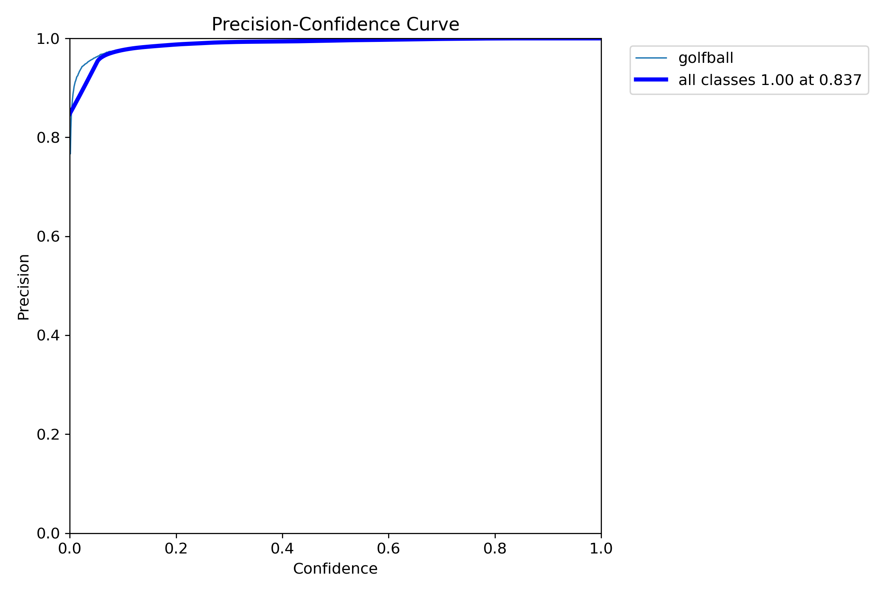

# Golf Ball Flight Tracker


This project is a computer vision application designed to detect a golf ball at impact, track its initial flight path, and predict its full trajectory using a Kalman filter. It also includes functionality to track the path of the golf club head through the swing.

## Table of Contents
- [Key Features](#key-features)
- [How It Works](#how-it-works)
  - [1. Object Detection](#1-object-detection)
  - [2. Launch Detection](#2-launch-detection)
  - [3. Initial Tracking Phase](#3-initial-tracking-phase)
  - [4. Trajectory Prediction Phase](#4-trajectory-prediction-phase)
- [Model Training](#model-training)
- [Limitations](#limitations)
- [Project Structure](#project-structure)
- [Installation](#installation)
- [Usage](#usage)

## Key Features

- **Deep Learning Detection:** Utilizes two custom-trained YOLOv8 models for robust detection of golf balls and club heads.
- **Kalman Filter Tracking:** Implements a Kalman filter for smooth tracking, outlier rejection, and physics-based trajectory prediction.
- **Launch Monitor Simulation:** Captures the initial launch data and then simulates the rest of the ball's flight, creating a clean, smooth trajectory line.
- **Club Head Path Visualization:** Optionally draws the path of the club head to analyze the swing plane.

## How It Works

The tracking pipeline is a multi-stage process that combines deep learning detection with classical state estimation techniques.

### 1. Object Detection

The foundation of the tracker is its ability to locate the golf ball and club head in each frame. This is achieved using two distinct deep learning models:

- **Ball Detection Model:** A YOLOv8 model trained on a custom dataset of images containing golf balls in various conditions (on the tee, in flight, on the ground).
- **Club Head Detection Model:** A separate YOLOv8 model trained to identify the club head during a golf swing.

These models output bounding boxes for all potential objects in the frame, which are then passed to the tracking logic.

### 2. Launch Detection

The system begins in a standby state, monitoring the highest-confidence golf ball detection. It triggers the tracking sequence only when a "launch" is detected. A launch is defined by two conditions being met simultaneously:
1. The ball moves more than a minimum pixel distance (`MOVE_THRESHOLD`).
2. The ball's vertical movement is upwards (`dy > 5`), indicating it has been struck and is gaining altitude.

### 3. Initial Tracking Phase

Once a launch is detected, the system enters a "tracking phase" for the first `20` frames of flight. In this phase, the Kalman filter operates in a **predict-correct cycle**:

1.  **Predict:** The filter predicts the ball's position in the current frame based on its state (position, velocity) from the previous frame.
2.  **Associate:** It searches the list of current-frame detections from the YOLOv8 model to find the one closest to its prediction. This "nearest neighbor" data association is crucial for ignoring false positives (e.g., birds, clouds, or other white objects).
3.  **Correct:** If a valid detection is found within a search radius (`MAX_JUMP_DISTANCE`), the filter corrects its state using the real-world measurement. This grounds the filter's physics model in reality. If no valid detection is found, the filter proceeds using its prediction alone.

### 4. Trajectory Prediction Phase

After successfully tracking the ball for 20 frames, the system has gathered enough data to understand the ball's initial launch vector. It then transitions to a "prediction phase".

In this mode, it **stops using input from the detector**. The trajectory is generated purely by iterating the Kalman filter's `predict()` step. The filter's motion model has been configured to simulate a realistic flight path by including two key parameters:

-   **Gravity (`self.gravity`):** A constant force applied to the vertical velocity in each step, causing the predicted path to form a parabolic arc.
-   **Drag (`self.drag`):** A friction factor applied to the velocity, simulating the visual effect of the ball slowing down as it travels away from the camera into the Z-axis.

This results in a smooth, continuous, and physically plausible trajectory line drawn on the screen, free from the jitter of late-flight detections.

## Model Training

The object detection models were trained using the Ultralytics YOLOv8 framework. The models were fine-tuned from the standard `yolov8s.pt` weights on custom-annotated datasets.

Below is a graph showing the Precision-Confidence curve for the ball-detecting model. 



## Limitations

While the project is somewhat effective, it has several limitations inherent to a 2D, single-camera approach:

-   **2D vs. 3D Space:** The entire system operates in 2D pixel space. It cannot provide real-world metrics like carry distance, apex height, or ball speed.
-   **Simplified Physics:** The physics model (gravity and drag) is a simplified approximation. It does not account for complex aerodynamic factors like ball spin (Magnus effect), wind, or changes in air density, which are critical for hyper-realistic simulation.
-   **Detection Robustness:** In visually "noisy" environments with many golf balls (e.g., a busy driving range) or other small white objects, the data association can fail, leading to an incorrect track.
-   **Camera Dependency:** The tracker's performance and the tuning of the physics parameters (`gravity`, `drag`) are highly dependent on the camera's position, angle, and lens properties. A different camera setup would require re-tuning these values.

## Project Structure

```
golf-ball-tracker/
│
├── data/               # Place input videos here
├── src/
│   ├── detection.py     # Detection of the golf ball
│   ├── tracking.py      # Kalman Filter implementation
│   ├── trajectory.py    # Parabolic curve fitting
│   ├── visualization.py # Drawing utilities
│   └── main.py          # Main execution pipeline
│
├── results/            # Output videos will be saved here
├── README.md
└── requirements.txt
```

## Installation

1. Install dependencies:
   ```bash
   pip install -r requirements.txt
   ```

## Usage

Run the tracker on a video file:

```bash
python src/main.py --video data/vid3.mp4
```

To also show the swing plane tracking, add this flag:

```bash
python src/main.py --video data/vid3.mp4 --track_club_head
```

The processed video with tracking overlays will be saved to `results/output.mp4`.